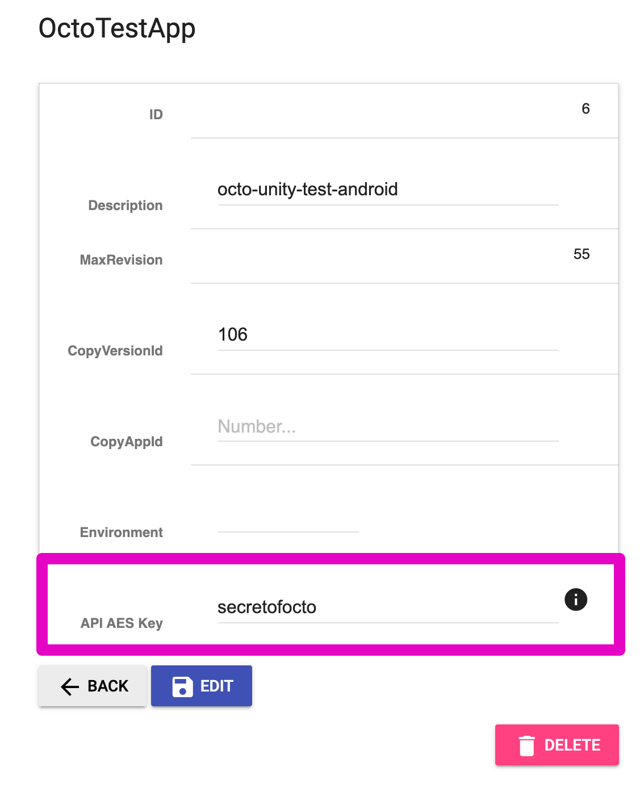

# APIの暗号化

OCTOではクライアント（Unityアプリ）向けにアセットのメタデータをListと呼んでいるAPIを通して配信しています。
このメタデータを解析すると本番向けに配信されている全てのアセットを容易にダウンロードすることが可能になります。
OCTOのスタンスとしては本番向けのアセットは隠す必要がないものと考えている（ネタバレを防ぐためにはそもそも本番に配信しない前提）のと、
アセット自体の保護はそれ自体の暗号化が必須になるので、メタデータを保護する価値がそこまでないものとしています。
ただし暗号化することでカジュアルハックを予防できる（ハードルを上げられる）のもまた事実なので、
その効果を期待して本番向けの環境では暗号化を必ず設定してください。

## Requirements

- octo-api: >= v1.1.0
- octo-unity-sdk: >= v2.7.0

## 暗号仕様

- アルゴリズム: AES-256 (CBC) + PKCS #7
- 鍵: 30文字以内のchar文字列をSHA-256でハッシュ化したもの
  - SHA-256でハッシュ化するので、元の文字列の長さは暗号強度とは無関係
  - 鍵はversion毎に変えられる
- IV: ランダム生成

## API仕様

互換性を保つために、平文のList APIと暗号化されているList APIは別のAPIになります。
暗号化するための鍵を管理画面から設定すると、平文APIがエラーを返すようになります。
逆に鍵がない場合は暗号化されているAPIはエラーを返します。

List API以外でクライアントから呼ばれるAPIにメタデータが含まれるものはありません。

## 暗号鍵の設定方法

管理画面よりversionの設定画面を開き、 `AES API Key` を設定してください。（30文字以内）

設定すると前述のように使えるAPIが切り替わりますので、クライアントの切り替えも同時に必要になります。
もしスムーズに切り替える必要がある場合、version自体も新しく作成する必要があります。
